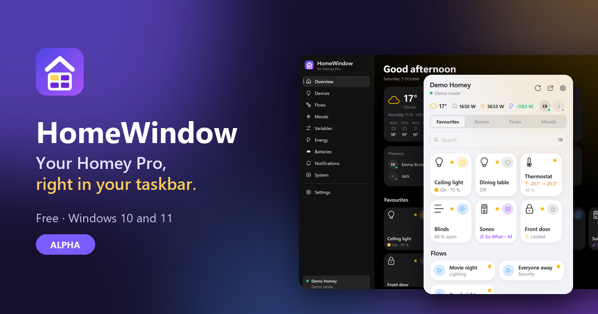
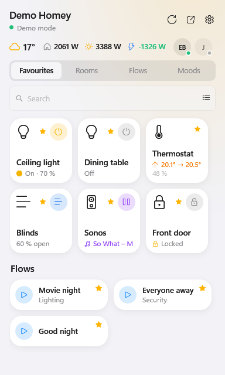
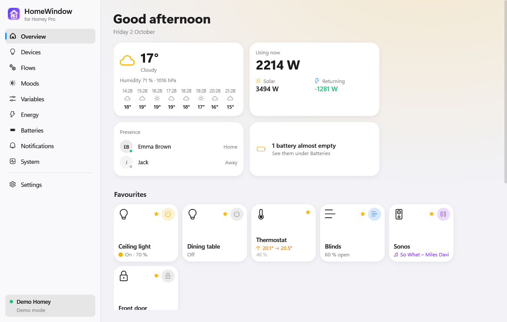

# HomeWindow – for Homey Pro

**English** · *[Nederlands](README.nl.md)* · **[Website and download](https://wnijhof.github.io/homewindow/)**

Control your **Homey Pro** from the Windows taskbar. One click on the icon by the clock and you switch lights, start a flow or pick a mood. The main window shows the rest: devices per room, energy, batteries, notifications and the health of your Homey.

> **Alpha.** HomeWindow is new and under active development. It works well on the Homeys it was tested with, but expect rough edges and changes. Please report what you run into in the [issues](https://github.com/WNijhof/homewindow/issues).

HomeWindow was inspired by [HomeBar](https://www.homebar.pro/) for the Mac, but it is a separate project with no connection to HomeBar or to Athom. Homey is a trademark of Athom.

| Panel by the clock | Main window |
|---|---|
|  |  |

## Which Homey

| Homey | Works |
|---|---|
| Homey Pro (2023) and Homey Pro mini | Yes |
| Homey Self-Hosted Server | Probably (same API, not tested) |
| Homey (with Homey Bridge, no Pro) | No: it has no API keys |
| Homey Pro (Early 2019) and older Homey Pro | Probably, by signing in with your Homey account (new in 0.4.3, not yet tested on one) |

HomeWindow uses the Homey Web API. You sign in with your Homey account: your browser opens Homey's sign-in page, and HomeWindow fills in your Homey by itself. A few parts need an API key instead, which you create in my.homey.app (Homey Pro 2023 and mini): the system page, updates, restarting apps, deleting notifications and the weather. Athom does not give those rights to apps that sign in with an account.

## What it does

- **Panel by the clock** (click the icon or press **Ctrl + Alt + H**): favourites, rooms, flows and moods, with the weather, energy right now and who is home. As a list or as tiles.
- **Tiles like the Homey app**: a round quick-action button, a coloured state (on, power, music, heating, locked) and up to two measurements you pick per device. Four tile sizes.
- **Control**: on/off, dimming, colour temperature, thermostats, blinds, speakers and locks. Every other setting and measurement of a device is one click away.
- **Favourites** of your own, or taken over from the Homey app.
- **PIN lock**, so colleagues or guests on your laptop cannot control your home.
- **Main window** with an overview and pages for devices (search, filter by type, collapse rooms), flows per folder, moods, Logic variables, energy, batteries, notifications and system (restart apps).
- **Energy**: use, solar, grid and home battery right now – also on the taskbar, with returned power in green – the biggest users, totals for today and this month, and a chart of the last 14 days.
- **At home and away**: local through your Homey's IP address, and automatically through Athom's cloud when you are out. More than one Homey is fine.
- **Looks**: light, dark or following Windows; the *Dashboard* style of the Homey energy dashboard or one of five other backgrounds; your own icons per device; text size. Dutch and English.
- Homey notifications and alarms (smoke, water, and if you like motion and doors) as Windows notifications, start with Windows, silent automatic updates, and a **demo mode** to look around without a Homey.

The full manual is in Dutch: **[HANDLEIDING](docs/HANDLEIDING.md)** (a browser translation works well).

## Install

1. Download `HomeWindow-Setup-<version>.exe` from the latest [release](https://github.com/WNijhof/homewindow/releases/latest).
2. Run it. Windows may warn that the publisher is unknown (the installer is not code-signed): choose **More info → Run anyway**.
3. HomeWindow installs for your Windows account, without admin rights, and adds itself to the Start menu. .NET is included.
4. On first start the settings open. Click **Sign in to Homey…** and sign in with your Homey account in the browser; HomeWindow then fills in your Homey and its IP address. Click **Save**.

Prefer an API key, for the system page, updates and the weather too? Choose **API key** instead of *Homey account* and fill in your Homey's IP address and the key:
   - Go to [my.homey.app](https://my.homey.app), pick your Homey and open **Settings → API Keys → New API Key**.
   - Give it the rights HomeWindow needs: devices (view and control), zones, flows (view and start), moods, Logic, notifications, users, energy, Insights, system, apps and geolocation (for the weather).
   - The IP address is in the Homey app under **Settings → General**.

HomeWindow then looks for new versions by itself and installs them silently (you can turn that off under Settings → Updates). Uninstall through **Windows Settings → Apps**.

Want to look around first? Run `HomeWindow.exe --demo`.

## No connection?

- **"Windows blocks the connection"** (or, in older versions, *"An attempt was made to access a socket in a way forbidden by its access permissions"*): a firewall or virus scanner keeps HomeWindow off the network, so it never reaches your Homey. Open the firewall of your security program, look for HomeWindow among the blocked applications, set it to *Allow* and restart HomeWindow (also quit it in the tray). This can happen again after an update, because the new version is a new file for the scanner.
- **The cloud does not work:** HomeWindow learns the Homey ID from the first connection at home. Away from home, or when the local connection never worked, fill in **Homey ID (cloud)** yourself. You find it in the address bar on [my.homey.app](https://my.homey.app) (`/homeys/<id>/`), or in your Homey's settings there.
- More in the [manual](docs/HANDLEIDING.md#8-problemen-oplossen) (Dutch).

## Privacy

HomeWindow only talks to your own Homey: directly on your network, or through Athom's cloud relay (`<homey-id>.connect.athom.com`) when you are away. It also asks GitHub whether there is a new version. Signing in goes through Athom's own sign-in page (`api.athom.com`); HomeWindow never sees or keeps your password. Nothing about your Homey goes anywhere else. Your settings are in `%APPDATA%\HomeWindow\settings.json`; the key to connect (an API key or the sign-in) is encrypted in it with your Windows account.

## Code signing policy

Free code signing provided by [SignPath.io](https://about.signpath.io), certificate by [SignPath Foundation](https://signpath.org).

- Committers and reviewers: [WNijhof](https://github.com/WNijhof)
- Approvers: [WNijhof](https://github.com/WNijhof)

Only what GitHub Actions builds from this repository is signed, and the maintainer approves each release separately. See [docs/SIGNING.md](docs/SIGNING.md).

Privacy: HomeWindow will not transfer any information to other networked systems unless specifically requested by the user, apart from what [Privacy](#privacy) above describes: your own Homey, and GitHub to check for a new version (you can turn that off under Settings → Updates).

## License

HomeWindow is open source under the [GNU General Public License v3.0](LICENSE): you may use, change and share it, as long as changed versions are also shared under the GPL-3.0, with their source.

Version 0.4.0 was released under the PolyForm Noncommercial License 1.0.0; from 0.4.1 on it is GPL-3.0 again.
