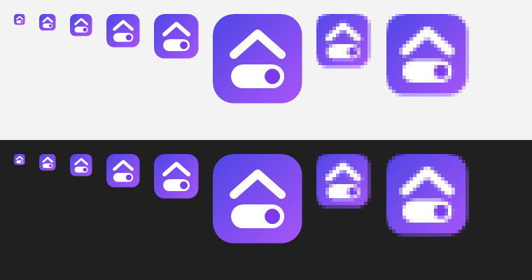
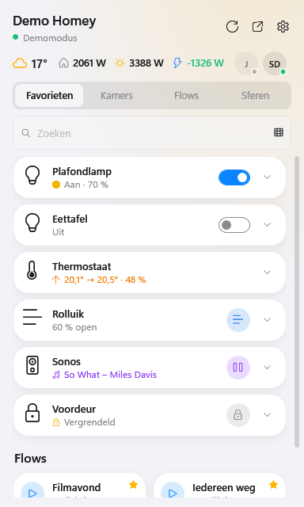
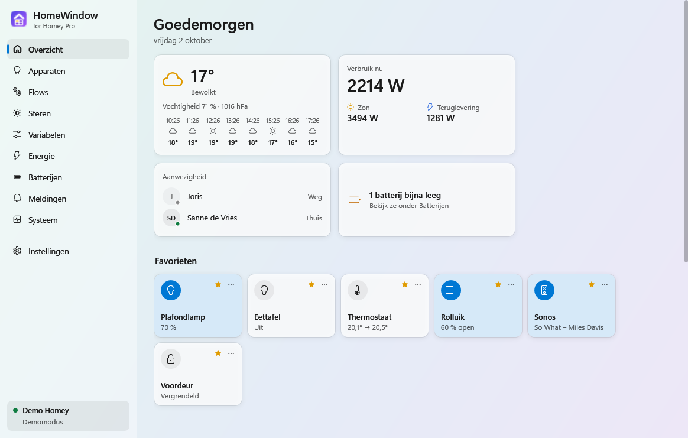

<p align="center"></p>

# HomeWindow – for Homey Pro

**Nederlands** · *[English](README.en.md)* · **[Website en download](https://wnijhof.github.io/homewindow/)**

Bedien je **Homey Pro** vanuit het Windows-systeemvak. Eén klik op het icoon bij de klok en je zet lampen aan, start een flow of kiest een sfeer. Het hoofdvenster laat de rest zien: apparaten per kamer, energie, batterijen, meldingen en de gezondheid van je Homey.

> **Alpha.** HomeWindow is nieuw en volop in ontwikkeling. Het werkt goed op de Homeys waarmee het getest is, maar verwacht nog ruwe randjes en veranderingen. Meld wat je tegenkomt bij de [issues](https://github.com/WNijhof/homewindow/issues).

HomeWindow is geïnspireerd op [HomeBar](https://www.homebar.pro/) voor de Mac, maar is een eigen project zonder band met HomeBar of met Athom. Homey is een merk van Athom. Tot versie 0.1 heette deze app *HomeyBar*.

## Welke Homey

| Homey | Werkt |
|---|---|
| Homey Pro (2023) en Homey Pro mini | Ja |
| Homey Self-Hosted Server | Waarschijnlijk wel (zelfde API, niet getest) |
| Homey (met Homey Bridge, zonder Pro) | Nee: die heeft geen API-keys |
| Homey Pro van vóór 2023 | Nee: andere, oudere API zonder API-keys |

HomeWindow werkt met de Web API van Homey en een API-key. Die API-keys maak je in my.homey.app, en dat kan alleen voor de modellen hierboven met *Ja*.

| Paneel bij de klok | Hoofdvenster |
|---|---|
|  |  |

## Wat kan het

- **Paneel bij de klok** (klik op het icoon of druk op **Ctrl + Alt + H**): favorieten, kamers, flows en sferen, met het weer, het verbruik van nu en wie er thuis is. Als lijst of als tegels.
- **Tegels zoals in de Homey-app**: een rond snelknopje, een gekleurde status (aan, vermogen, muziek, verwarmen, op slot) en tot twee metingen die je per apparaat kiest. Drie tegelgroottes.
- **Bedienen**: aan/uit, dimmen, kleurtemperatuur, thermostaat, rolluiken, speakers en sloten. Per apparaat zijn ook alle andere instellingen en metingen te zien.
- **Hoofdvenster** met een overzicht en pagina's voor apparaten (zoeken, filteren op soort, kamers inklappen), flows per map, sferen, variabelen, energie, batterijen, meldingen en systeem (apps met hun icoon, herstarten).
- **Energie**: verbruik, zon, net en thuisbatterij op dit moment (ook in de taakbalk naast de klok, met teruglevering in het groen), de grootste verbruikers, totalen van vandaag en deze maand, en een grafiek van de laatste 14 dagen.
- **Thuis en onderweg**: lokaal via het IP-adres van je Homey en automatisch via de cloud van Athom als je niet thuis bent. Meerdere Homeys mogelijk.
- **Uiterlijk**: licht, donker of volgens Windows, de stijl van het Homey-energiedashboard of een van vijf andere achtergronden (Papier, Aurora, Schemer, Oceaan, Glas), eigen pictogrammen per apparaat, tekstgrootte. Nederlands en Engels.
- Nieuwe Homey-meldingen en alarmen (rook, water, en als je wilt ook beweging en deuren) als Windows-melding, starten met Windows, en een **demomodus** om alles te bekijken zonder Homey.

Hoe je alles gebruikt staat in de **[handleiding](docs/HANDLEIDING.md)**.

## Installeren

1. Download `HomeWindow-Setup-<versie>.exe` bij de nieuwste [release](https://github.com/WNijhof/homewindow/releases/latest).
2. Start het bestand. Windows kan waarschuwen dat de uitgever onbekend is (de installer is niet digitaal ondertekend): kies **Meer informatie → Toch uitvoeren**.
3. HomeWindow installeert voor jouw Windows-account, zonder beheerdersrechten, en zet zichzelf in het Start-menu. .NET zit in de installer; je hoeft niets anders te installeren.
4. Bij de eerste start opent Instellingen: vul het IP-adres van je Homey en een API-key in. De [handleiding](docs/HANDLEIDING.md#een-api-key-maken) legt uit hoe je die maakt.

HomeWindow zoekt daarna zelf naar nieuwe versies en installeert die stil (uit te zetten bij Instellingen → Updates). Verwijderen gaat via **Windows-instellingen → Apps**.

Eerst rondkijken zonder Homey? Start `HomeWindow.exe --demo`.

## Privacy

HomeWindow praat met je eigen Homey: rechtstreeks in je netwerk, of via de cloud-doorgang van Athom (`<homey-id>.connect.athom.com`) als je niet thuis bent. Daarnaast vraagt hij bij GitHub of er een nieuwe versie is. Er gaat geen informatie over je Homey naar andere partijen. Je instellingen staan in `%APPDATA%\HomeWindow\settings.json`; de API-key is daarin versleuteld met je Windows-account.

## Licentie

HomeWindow valt onder de [PolyForm Noncommercial License 1.0.0](LICENSE). De broncode is openbaar: je mag HomeWindow gratis gebruiken, aanpassen en verder verspreiden, maar niet voor commerciële doeleinden. Thuis, als hobby, voor studie of bij een non-profitorganisatie mag alles; geld verdienen met HomeWindow of een aangepaste versie mag niet zonder toestemming. Geef bij verspreiden de licentie en de regel `Required Notice` door.

Versies tot en met 0.3.0 zijn uitgebracht onder de GNU GPL v3.0; wie die versies heeft, houdt die rechten voor die versies.

## Ontwikkelen

```
cd HomeWindow
dotnet run                                    # starten
dotnet run -- --demo                          # met het voorbeeldhuis
dotnet run -- --snapshot ..\.shots\x [--dark] [--en]  # alle schermen van de demo als PNG
cd ..
dotnet test                                   # de tests in HomeWindow.Tests
```

De tests draaien ook op GitHub bij elke push (`.github/workflows/test.yml`) en vóór elke release.

Zelf bouwen vraagt de [.NET 10 SDK](https://dotnet.microsoft.com/download/dotnet/10.0). De installer bouw je met [Inno Setup 6](https://jrsoftware.org/isinfo.php) (`winget install JRSoftware.InnoSetup`):

```
powershell -ExecutionPolicy Bypass -File scripts\build-installer.ps1 [-Version 0.2.0] [-SelfContained]
```

Zonder `-SelfContained` is de installer klein en heeft de pc de .NET 10 Desktop Runtime nodig (de installer controleert dat). Met `-SelfContained` zit .NET erin; daarvoor moet NuGet de runtime-pakketten kunnen downloaden.

### Een nieuwe versie uitbrengen

```
git tag v0.2.0
git push origin v0.2.0
```

Staat er een bestand `docs/releases/<versie>.md`, dan worden dat de releasenotes; de eerste regel (`# ...`) is de titel. De workflow `.github/workflows/release.yml` bouwt dan de installer (met .NET erin) en zet hem als release op GitHub. Geïnstalleerde exemplaren van HomeWindow vinden die binnen zes uur en werken zichzelf bij. GitHub laat releases alleen zonder inloggen zien bij een **openbare** repository; bij een privé-repository vindt HomeWindow geen updates.

| Map | Inhoud |
|---|---|
| `HomeWindow/Core` | Verbinding met Homey (`HomeyClient`), ophalen en bijhouden van gegevens (`HomeyStore`), modellen, thema, systeemvak, vertalingen, demohuis |
| `HomeWindow/Views` | Het paneel (`FlyoutWindow`), het hoofdvenster met de pagina's, stijlen en sjablonen |
| `HomeWindow.Tests` | Tests (xUnit) van de rekenregels, het lezen van Homey-gegevens, de favorieten, de instellingen en het demohuis |
| `site` | De website (GitHub Pages, via `.github/workflows/pages.yml`) |
| `installer` | Het Inno Setup-script van de installer |
| `scripts` | `build-installer.ps1` bouwt de installer, `make-icon.ps1` maakt het logo, `strings.js` toont teksten zonder Engelse vertaling, `screenshot.ps1` maakt een schermafbeelding van een venster |

Teksten staan in het Nederlands in de code; `HomeWindow/Core/Loc.En.cs` vertaalt ze naar het Engels. HomeWindow gebruikt de Web API van Homey Pro (`/api/manager/...`) met een API-key en haalt elke paar seconden nieuwe gegevens op terwijl een venster open is.
