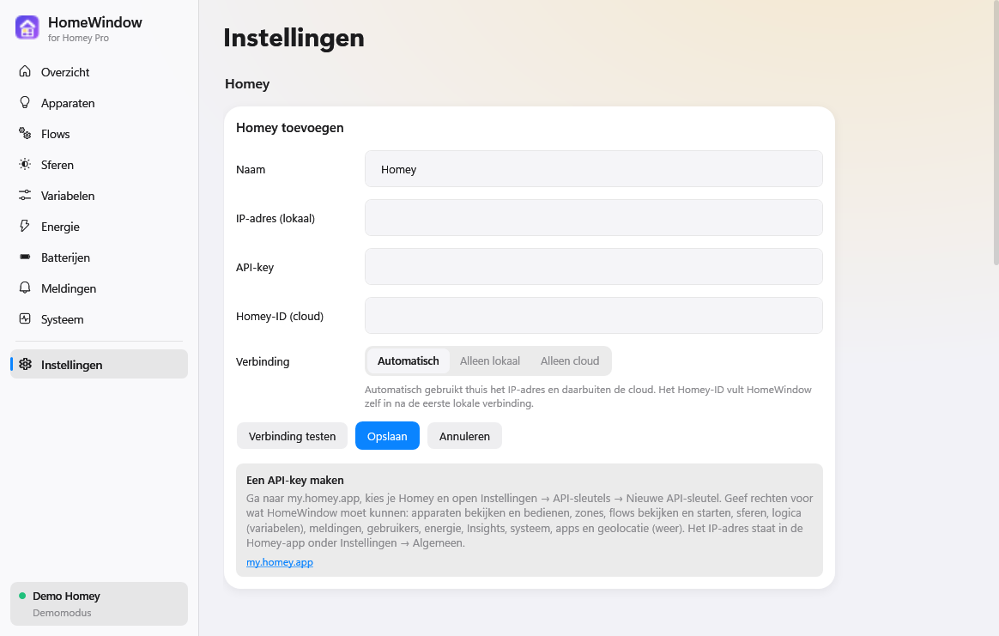
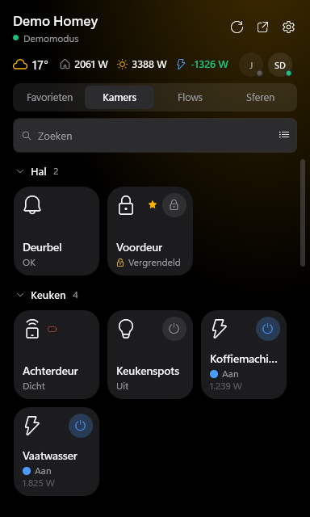
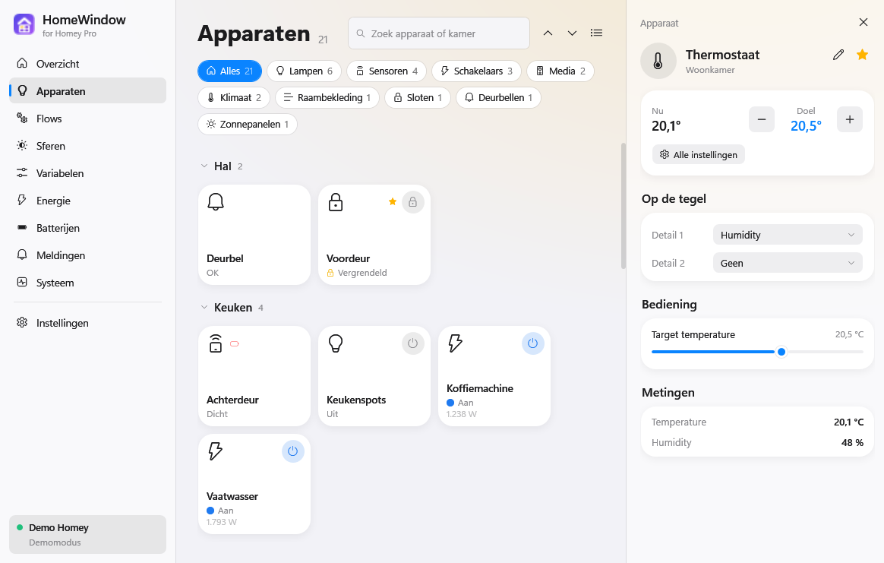
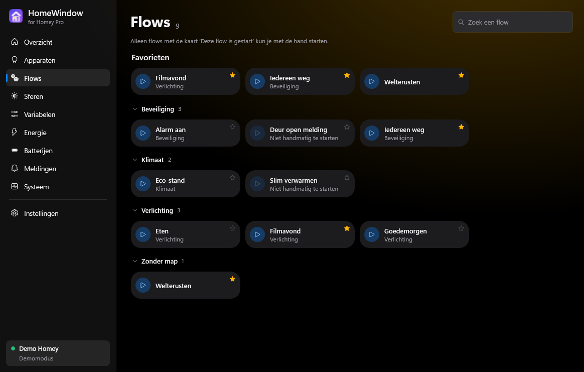
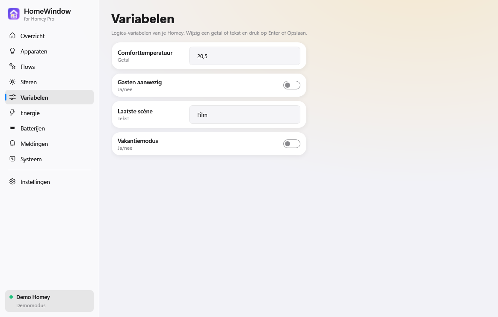
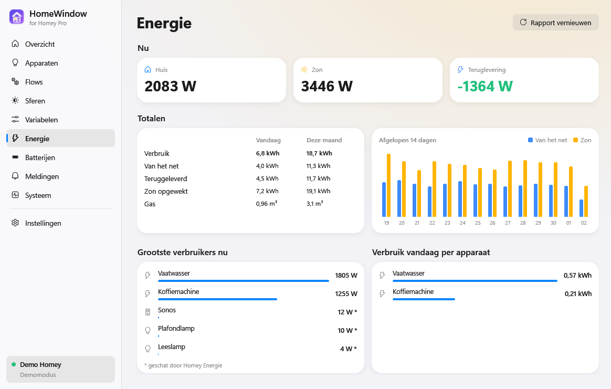
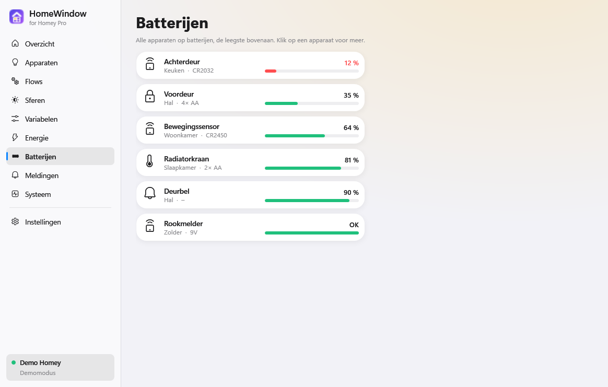
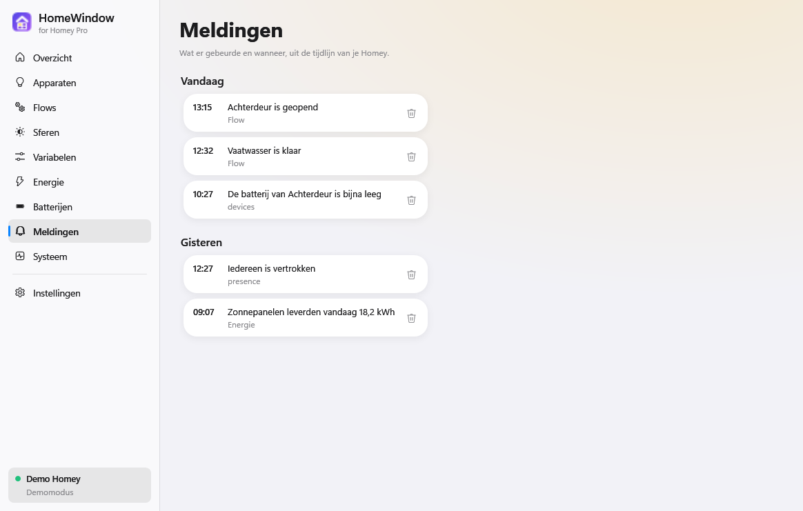
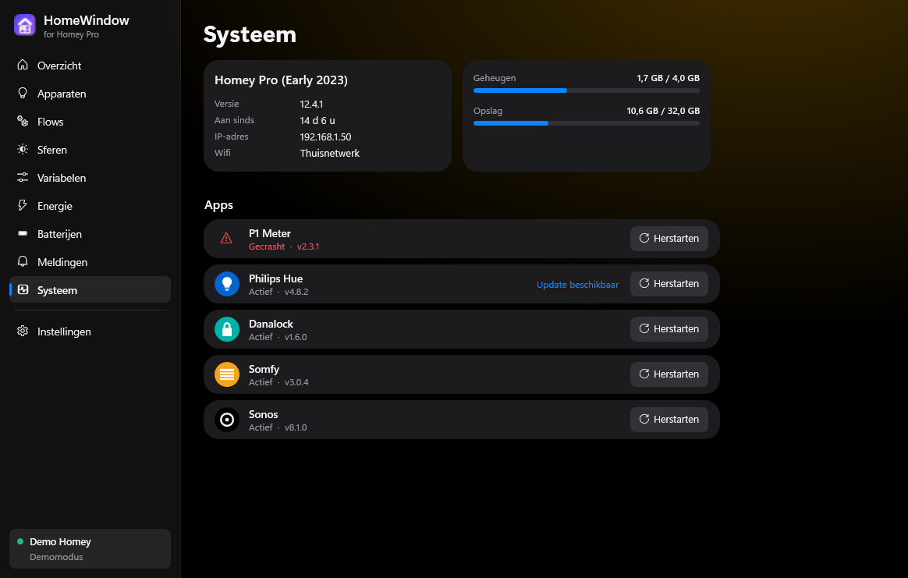

# Handleiding HomeWindow

HomeWindow zet je Homey Pro in het Windows-systeemvak, naast de klok. Deze handleiding legt uit hoe je hem koppelt en wat alle onderdelen doen.

**Inhoud**

1. [Eerste keer instellen](#1-eerste-keer-instellen)
2. [Het paneel bij de klok](#2-het-paneel-bij-de-klok)
3. [Apparaten bedienen](#3-apparaten-bedienen)
4. [Het hoofdvenster](#4-het-hoofdvenster)
5. [Onderweg verbinden](#5-onderweg-verbinden)
6. [Instellingen](#6-instellingen)
7. [Sneltoetsen](#7-sneltoetsen)
8. [Problemen oplossen](#8-problemen-oplossen)
9. [Verwijderen](#9-verwijderen)

---

## 1. Eerste keer instellen

### Werkt het met mijn Homey?

HomeWindow werkt met een **Homey Pro (2023)** of **Homey Pro mini**, en waarschijnlijk ook met de **Homey Self-Hosted Server**. Een gewone Homey met Homey Bridge, of een Homey Pro van vóór 2023, wordt niet ondersteund: die hebben geen API-keys.

### Installeren

1. Download `HomeWindow-Setup-<versie>.exe` bij de nieuwste [release op GitHub](https://github.com/WNijhof/homewindow/releases/latest).
2. Start het bestand. Omdat de installer niet digitaal ondertekend is, kan Windows *Windows heeft uw pc beschermd* tonen. Klik op **Meer informatie** en dan **Toch uitvoeren**.
3. Kies of HomeWindow met Windows mee moet starten (aanbevolen) en of je een snelkoppeling op het bureaublad wilt.
4. Klik op **Installeren**. HomeWindow komt in je eigen gebruikersmap (`%LOCALAPPDATA%\Programs\HomeWindow`); je hebt geen beheerdersrechten nodig. Wil je hem voor alle gebruikers van de pc installeren, kies dat dan in het eerste scherm van de installer.

Een nieuwere installer over een bestaande installatie heen draaien werkt gewoon: je instellingen blijven bewaard.

### Koppelen aan je Homey

Je hebt drie dingen nodig: het **IP-adres** van je Homey, een **API-key** en een paar minuten.

### Het IP-adres vinden

Open de Homey-app op je telefoon en ga naar **Instellingen → Algemeen**. Daar staat het IP-adres, bijvoorbeeld `192.168.1.50`. Je vindt het ook in het overzicht van je router.

Geef je Homey in je router een vast IP-adres. Anders kan het adres na een herstart veranderen en vindt HomeWindow hem thuis niet meer (onderweg werkt de cloud dan nog wel).

### Een API-key maken

1. Ga naar [my.homey.app](https://my.homey.app) en log in.
2. Kies je Homey en open **Instellingen → API-sleutels**.
3. Klik op **Nieuwe API-sleutel** en geef hem een naam, bijvoorbeeld *HomeWindow*.
4. Vink de rechten aan voor wat HomeWindow moet kunnen. Voor alles:

   | Recht | Nodig voor |
   |---|---|
   | Apparaten bekijken en bedienen | Apparaten zien en schakelen (verplicht) |
   | Zones bekijken | Apparaten per kamer |
   | Flows bekijken en starten | De flows-pagina en flows starten |
   | Sferen bekijken en instellen | Sferen |
   | Logica bekijken en bewerken | Variabelen |
   | Meldingen bekijken | De tijdlijn en Windows-meldingen |
   | Gebruikers bekijken | Wie er thuis is |
   | Energie bekijken | Geschat verbruik van apparaten zonder eigen meter |
   | Insights bekijken | Totalen van vandaag en deze maand, de grafiek van 14 dagen |
   | Systeem bekijken | Versie, geheugen, opslag en updates |
   | Apps bekijken en beheren | De lijst met apps en apps herstarten |
   | Geolocatie bekijken | Het weer |

   De namen in my.homey.app kunnen iets anders zijn. Laat je een recht weg, dan werkt de rest gewoon; op die pagina staat dan *Geen toegang*.
5. Kopieer de sleutel. Je ziet hem maar één keer.

### HomeWindow koppelen

1. Start HomeWindow. De eerste keer opent meteen **Instellingen** met het formulier *Homey toevoegen*.
2. Vul in:
   - **Naam**: hoe je Homey in HomeWindow heet.
   - **IP-adres (lokaal)**: bijvoorbeeld `192.168.1.50`.
   - **API-key**: de sleutel uit my.homey.app.
   - **Homey-ID (cloud)**: laat leeg; HomeWindow vult dit zelf in (zie [Onderweg verbinden](#5-onderweg-verbinden)).
   - **Verbinding**: laat op *Automatisch*.
3. Klik op **Verbinding testen**. Je ziet hoeveel apparaten er gevonden zijn, en de naam van je Homey wordt ingevuld.
4. Klik op **Opslaan**.

HomeWindow staat nu in het systeemvak. Zie je het icoon niet, klik dan op het pijltje **^** naast de klok en sleep het HomeWindow-icoon naar de taakbalk, zodat het altijd zichtbaar is.

> **Eerst rondkijken?** Start `HomeWindow.exe --demo`. Je krijgt dan een voorbeeldhuis waarin alles werkt, zonder dat er iets met je eigen Homey gebeurt.

---

## 2. Het paneel bij de klok

Klik op het HomeWindow-icoon bij de klok (of druk op **Ctrl + Alt + H**). Het paneel schuift omhoog. Klik ergens anders of druk op **Esc** om het te sluiten.

| Favorieten (lijst) | Kamers (tegels, donker thema) |
|---|---|
|  |  |

**Bovenaan** staan de naam van je Homey en de verbinding (groen bolletje = lokaal, blauw = via de cloud). De knoppen rechts:

- ↻ gegevens nu vernieuwen
- ↗ het hoofdvenster openen
- ⚙ instellingen

**Daaronder** het weer, het verbruik van je huis, de opbrengst van de zonnepanelen en wat er van of naar het net gaat. Rechts staan de mensen met een Homey-account: een groen bolletje is thuis, blauw slaapt, grijs is weg. Weer en energie kun je uitzetten bij Instellingen.

**De tabbladen:**

- **Favorieten**: de apparaten en flows die jij als favoriet hebt gemarkeerd (zie [Favorieten](#favorieten)).
- **Kamers**: alle apparaten per kamer. Klik op een kamernaam om hem in of uit te klappen; HomeWindow onthoudt dat.
- **Flows**: alle flows per map. Klik op een flow om hem te starten.
- **Sferen**: klik op een sfeer om hem in te schakelen.

**Zoeken**: typ in het zoekveld (of begin gewoon te typen) om apparaten, kamers, flows of sferen te vinden. Op het tabblad Favorieten is zoeken uit.

**Lijst of tegels**: het knopje rechts in het zoekveld wisselt tussen een lijst en tegels.

### Het menu onder de rechtermuisknop

Klik met de rechtermuisknop op het icoon bij de klok voor:

- **HomeWindow openen**: het hoofdvenster
- **Flows starten**: je favoriete flows, zonder het paneel te openen
- **Sferen**
- **Homey wisselen**: alleen als je meer dan één Homey hebt
- **Opnieuw verbinden**
- **Instellingen**
- **Afsluiten**: HomeWindow helemaal stoppen

### Het bolletje op het icoon

| Icoon | Betekenis |
|---|---|
| zonder bolletje | Lokaal verbonden |
| blauw bolletje | Verbonden via de cloud |
| oranje bolletje | Bezig met verbinden |
| rood bolletje | Geen verbinding (beweeg de muis over het icoon voor de reden) |

### Energie in de taakbalk

Links van de iconen bij de klok staat het energieverbruik van nu: wat je huis verbruikt (⌂), wat de zon opwekt (☀) en wat er van het net komt (⚡). Lever je terug, dan staat het netvermogen er als negatief getal in het groen, bijvoorbeeld **-1364 W**. Beweeg de muis erover voor de uitleg; klik erop om het paneel te openen.

Het strookje verschijnt alleen als HomeWindow energiegegevens van je Homey heeft. Je zet het uit bij **Instellingen → Uiterlijk → Energie in de taakbalk**. Windows heeft hier geen officiële plek voor, dus HomeWindow zet het strookje zelf in de taakbalk. Na een grote Windows-update kan het daardoor even verkeerd staan of ontbreken.

---

## 3. Apparaten bedienen

### Snel schakelen

- **Tegel**: klik op het ronde knopje rechtsboven, net als in de Homey web-app. Een lamp of stopcontact gaat aan of uit, een slot op slot of open, een speaker speelt of pauzeert, een rolluik gaat op of neer. Heb je in de Homey-app voor een apparaat een snelle actie gekozen, dan gebruikt HomeWindow die. Klik je ergens anders op de tegel, dan zie je de details van het apparaat.
- **Lijst**: gebruik de schakelaar (of het ronde knopje) rechts in de rij. Klik je op de rij zelf, dan zie je de details.

De tegels lijken op die in de Homey-app. Staat een apparaat aan, dan kleurt het ronde knopje: geel voor lampen, paars voor speakers en blauw voor de rest. Voor de status staat een gekleurd tekentje: een bolletje als het apparaat aan staat, een bliksem bij vermogen (groen bij teruglevering), een muzieknoot bij muziek, een oranje pijl als een thermostaat verwarmt en een slotje bij een slot. Een sensor met een alarm (beweging, rook, open deur) krijgt een rood icoon.

Onder de status staat op een tegel een meting, zoals het vermogen van een stopcontact of de luchtvochtigheid bij een thermostaat. Welke meting dat is, kies je zelf in de details van het apparaat onder **Op de tegel**: bij **Detail 1** een andere meting of **Geen**, en bij **Detail 2** eventueel een tweede. HomeWindow onthoudt dat per apparaat. Een rood batterijtje betekent dat de batterij bijna leeg is. In de lijst staan die metingen achter de status.

### Meer bediening

- **In de lijst**: klik op het pijltje ⌄ rechts in de rij. De rij klapt open met de bediening die voor dat apparaat past:
  - een **schuifregelaar** voor de helderheid, en voor de kleurtemperatuur als de lamp dat kan
  - de **thermostaat**: de huidige temperatuur en de doeltemperatuur met **−** en **+**
  - een **rolluik**: omhoog, stop, omlaag en de positie
  - een **speaker**: vorige, afspelen/pauze, volgende en het volume
  - een **slot**: vergrendelen of ontgrendelen
- **Op een tegel**: klik op de tegel.

### Alle instellingen van een apparaat

Klik op een tegel of rij, op **Alle instellingen** onder de bediening, of kies **Alle instellingen** onder de rechtermuisknop. In het hoofdvenster opent het paneel rechts naast de lijst; in het paneel bij de klok schuift het eroverheen (terug met **Terug** of **Esc**).

Je ziet:

- **Bediening**: alles wat je aan het apparaat kunt instellen, met schakelaars, schuifregelaars, keuzes en knoppen.
- **Metingen**: alle meetwaarden. Beweeg de muis over een meting om te zien wanneer hij voor het laatst veranderde.
- Het soort batterij, als de app van het apparaat dat doorgeeft.

Rechtsboven staan twee knoppen:

- ✎ **Ander pictogram**: kies een eigen pictogram, of **Standaard pictogram** om terug te gaan.
- ☆ **Favoriet**: zet het apparaat bij je favorieten (of haal het eraf).

### Favorieten

Een apparaat zet je bij je favorieten met de ster in zijn instellingen, of met de rechtermuisknop → **Favoriet**. Bij een flow klik je op het sterretje rechtsboven op de tegel. Favorieten verschijnen in het paneel bij de klok, op het overzicht en (flows) in het menu onder de rechtermuisknop. Ze worden per Homey bewaard, in de volgorde waarin je ze toevoegt.

> Een wijziging is meteen te zien. Komt Homey binnen een paar seconden met een andere waarde (omdat het apparaat niet reageerde), dan toont HomeWindow weer de echte stand en verschijnt er een rode melding onderaan.

---

## 4. Het hoofdvenster

Open het hoofdvenster met ↗ in het paneel, met **HomeWindow openen** in het menu, of door HomeWindow nog een keer te starten. Het kruisje sluit alleen het venster; HomeWindow blijft in het systeemvak draaien. Afsluiten doe je via het menu onder de rechtermuisknop.

Links staan de pagina's, en onderaan de verbinding. Heb je meer dan één Homey, dan wissel je bovenaan in de zijbalk.

### Overzicht

Het weer (met de verwachting voor de komende uren), het verbruik van nu, wie er thuis is, een waarschuwing als er batterijen bijna leeg zijn, je favoriete apparaten en flows, je sferen en de laatste vijf meldingen.

### Apparaten

Alle apparaten per kamer. Boven de lijst:

- **Zoeken** op naam van een apparaat of kamer.
- **Soort**: klik op een soort (Lampen, Sensoren, Klimaat, Raambekleding, Media, …) om alleen die te zien. **Alles** toont weer alles.
- **⌃ / ⌄**: alle kamers inklappen of uitklappen.
- **Lijst of raster**: hoe de apparaten worden getoond.

### Flows

Je favoriete flows, en daaronder alle flows per map, ook geavanceerde flows. Klik op een flow om hem te starten. Het icoon wordt even groen als het gelukt is, of rood als het misging.

Alleen flows die beginnen met de kaart **Deze flow is gestart** kun je met de hand starten. Andere flows zijn grijs, met *Niet handmatig te starten*. Uitgeschakelde flows staan er ook bij, als *Uitgeschakeld*.

### Sferen

Alle sferen met hun kamer. Klik om een sfeer in te schakelen. Sferen maak je in de Homey-app, bij een kamer.

### Variabelen

De logica-variabelen van je Homey. Een ja/nee-variabele zet je met de schakelaar. Bij een getal of tekst typ je de nieuwe waarde en druk je op **Enter** of klik je **Opslaan**.

### Energie

- **Nu**: wat je huis verbruikt, wat de zonnepanelen opwekken, wat er van het net komt of wordt teruggeleverd, en wat een thuisbatterij laadt of ontlaadt. Teruglevering staat er als negatief getal in het groen.
- **Grootste verbruikers nu**: apparaten met een eigen vermogensmeter. Met een * erachter is het een schatting van Homey Energie (bijvoorbeeld een lamp zonder meter).
- **Verbruik vandaag per apparaat**: uit de kWh-meters van de apparaten.
- **Totalen** voor vandaag en deze maand: verbruik, van het net, teruggeleverd, zon opgewekt en gas.
- **Afgelopen 14 dagen**: per dag wat er van het net kwam en wat de zon opwekte. Beweeg de muis over een dag voor de getallen.

HomeWindow vindt je slimme meter (P1), zonnepanelen en thuisbatterij zelf, aan de hand van hoe ze in Homey Energie staan. De totalen en de grafiek komen uit Insights. Ze worden geladen als je de pagina opent en daarna elke vijf minuten; **Rapport vernieuwen** laadt ze meteen opnieuw.

### Batterijen

Alle apparaten op batterijen, de leegste bovenaan, met het soort batterij als de app dat doorgeeft. Onder 20 % of bij een batterijalarm wordt het rood. Klik op een apparaat voor de details.

### Meldingen

De tijdlijn van je Homey, per dag. Met de prullenbak verwijder je een melding, ook op je Homey zelf.

### Systeem

Het model en de versie van je Homey, hoe lang hij aan staat, het IP-adres en het wifi-netwerk. Verder het gebruik van geheugen en opslag, en een melding als er een Homey-update klaarstaat.

Onder **Apps** staan al je Homey-apps, met hun eigen icoon. Gecrashte apps staan bovenaan in rood, daarna apps met een update. Met **Herstarten** start je een app opnieuw op.

Deze pagina vernieuwt elke tien seconden zolang hij open is.

---

## 5. Onderweg verbinden

Buiten je eigen netwerk verbindt HomeWindow via de cloud-doorgang van Athom, met dezelfde API-key. Je hoeft niets in je router open te zetten.

- Met de verbinding op **Automatisch** probeert HomeWindow eerst het IP-adres. Reageert dat niet binnen drie seconden, dan gaat hij via de cloud.
- Daarvoor heeft HomeWindow het **Homey-ID** nodig. Dat leest hij zelf uit bij de eerste verbinding thuis. Je kunt het ook zelf invullen bij **Homey-ID (cloud)**.
- Ben je weer thuis, dan gaat HomeWindow binnen ongeveer twee minuten vanzelf terug naar de snellere lokale verbinding.

Wil je zeker weten dat de cloud werkt? Zet de verbinding bij Instellingen even op **Alleen cloud** en klik **Verbinding testen**. Zet hem daarna terug op *Automatisch*.

Via de cloud reageert alles wat trager dan thuis.

---

## 6. Instellingen

### Homey

Hier voeg je een Homey toe, wijzig je hem of verwijder je hem. Met meerdere Homeys (bijvoorbeeld thuis en een vakantiehuis) wissel je via de zijbalk van het hoofdvenster of via **Homey wisselen** in het menu. Favorieten, pictogrammen en ingeklapte kamers worden per Homey bewaard.

**Verbinding** kan op drie standen:

| Stand | Wat het doet |
|---|---|
| Automatisch | Thuis lokaal, anders via de cloud (aanbevolen) |
| Alleen lokaal | Nooit via de cloud |
| Alleen cloud | Altijd via de cloud, ook thuis |

### Uiterlijk

| Instelling | Wat het doet |
|---|---|
| Thema | Licht, donker, of zoals Windows staat ingesteld |
| Achtergrond | Dashboard (standaard), Papier, Aurora, Schemer, Oceaan of Glas. Dashboard heeft de stijl van het Homey-energiedashboard: effen kaarten en een zachte gloed in de kleur van waar je stroom nu vandaan komt (zon, net of batterij); Intensiteit regelt die gloed. Glas laat het bureaublad doorschemeren (alleen Windows 11). |
| Intensiteit | Hoe sterk de kleur van de achtergrond is |
| Tekstgrootte | Alles groter of kleiner, van 85 tot 130 % |
| Schaduwen | Schaduwen onder de kaarten |
| Tegelgrootte | Klein, Normaal of Groot, voor het hoofdvenster en het paneel. Groot zet in het paneel twee tegels naast elkaar en laat lange namen over twee regels lopen. |
| Paneel bij de klok | Apparaten als lijst of als tegels |
| Hoofdvenster | Apparaten als raster of als lijst |
| Weer / Energie in het paneel | Deze regel bovenin het paneel tonen |
| Energie in de taakbalk | Het verbruik van nu links van de klok tonen |

De accentkleur (van schakelaars en actieve apparaten) volgt de accentkleur van Windows.

### Algemeen

| Instelling | Wat het doet |
|---|---|
| Starten met Windows | HomeWindow start stil in het systeemvak als je inlogt |
| Sneltoets | Ctrl + Alt + H opent het paneel |
| Meldingen van Homey tonen | Nieuwe meldingen uit de tijdlijn verschijnen als Windows-melding. Klik erop om HomeWindow te openen. |
| Taal | Automatisch (volgt Windows), Nederlands of English. Start HomeWindow opnieuw om te wisselen. |

### Updates

Met **Automatisch bijwerken** aan (standaard) kijkt HomeWindow kort na het opstarten en daarna elke zes uur op GitHub of er een nieuwe versie is. Is die er, dan:

1. downloadt HomeWindow de nieuwe installer en controleert hij die met de controlesom die GitHub erbij publiceert;
2. wacht hij tot je HomeWindow niet gebruikt (het paneel is dicht en het hoofdvenster heeft de focus niet);
3. installeert hij de nieuwe versie stil en start daarna vanzelf opnieuw. Je ziet een melding *Bijgewerkt naar versie …*.

> **Had je HomeyBar?** Zo heette deze app tot versie 0.1. HomeyBar werkt zichzelf bij naar HomeWindow, net als bij elke andere update. Je Homeys, favorieten en de keuze voor *Starten met Windows* gaan mee, en de oude map en snelkoppeling worden opgeruimd.

Je instellingen, favorieten en de keuze voor *Starten met Windows* blijven daarbij hetzelfde.

Met **Nu controleren** zoek je meteen, en installeer je een gevonden versie direct, ook als automatisch bijwerken uit staat. Daaronder zie je je huidige versie en de uitkomst van de laatste controle.

Automatisch bijwerken werkt alleen als HomeWindow met de installer is geïnstalleerd, niet als je hem zelf uit de broncode hebt gebouwd.

---

## 7. Sneltoetsen

| Toets | Waar | Wat |
|---|---|---|
| Ctrl + Alt + H | Overal | Paneel bij de klok openen of sluiten |
| Esc | Paneel | Details sluiten, of het paneel sluiten |
| Esc | Hoofdvenster | Het detailpaneel sluiten |
| F5 | Paneel en hoofdvenster | Nu vernieuwen |
| Letters typen | Paneel | Zoeken (niet op het tabblad Favorieten) |
| Enter | Variabelen | De waarde opslaan |

---

## 8. Problemen oplossen

| Wat je ziet | Wat je kunt doen |
|---|---|
| **De API-key is ongeldig of ingetrokken** | Maak een nieuwe API-key in my.homey.app en vul hem in bij Instellingen → Wijzigen. |
| **De API-key mag de apparaten niet bekijken** | Geef de API-key het recht om apparaten te bekijken. Een API-key kun je niet aanpassen, dus maak een nieuwe. |
| ***Geen toegang*** op één pagina | De API-key mist het recht voor dat onderdeel (zie de tabel bij [Een API-key maken](#een-api-key-maken)). De rest werkt gewoon. |
| **Lokaal: geen antwoord** | Klopt het IP-adres? Zit je pc in hetzelfde netwerk als je Homey (niet in een gastnetwerk)? Probeer `http://<ip-adres>` in je browser. |
| **Geen adres of Homey-ID ingesteld** | Vul het IP-adres in, of het Homey-ID voor de cloud. |
| Werkt thuis, maar onderweg niet | HomeWindow kent het Homey-ID nog niet. Verbind één keer thuis, of vul het ID zelf in. |
| *Geen releases gevonden op GitHub* bij Updates | Er is nog geen versie uitgebracht, of de repository op GitHub is privé. |
| Het icoon is niet te zien | Klik op **^** naast de klok en sleep het HomeWindow-icoon naar de taakbalk. |
| Ctrl + Alt + H doet niets | Een ander programma gebruikt die combinatie al. Sluit dat programma, of zet de sneltoets uit en weer aan bij Instellingen. |
| De energietotalen blijven leeg | Geef de API-key het recht om Insights te bekijken. Zonder slimme meter telt HomeWindow alleen apparaten met een eigen kWh-meter. |
| Het weer ontbreekt | Geef de API-key het recht om de geolocatie te bekijken, en controleer of je Homey een locatie heeft. |
| Een schakelaar springt terug | Het apparaat reageerde niet. Kijk in de Homey-app of het bereikbaar is. |

HomeWindow haalt elke 2,5 seconden nieuwe gegevens op als het paneel of het hoofdvenster open is, en elke 15 seconden als alles dicht is. Na een verbroken verbinding probeert hij het steeds opnieuw, eerst snel en daarna elke 30 seconden. **Opnieuw verbinden** in het menu probeert het meteen.

---

## 9. Verwijderen

1. Open **Windows-instellingen → Apps → Geïnstalleerde apps**, zoek **HomeWindow** en kies **Verwijderen**. HomeWindow wordt eerst afgesloten en ook uit het opstarten van Windows gehaald.
2. Aan het eind vraagt de verwijderaar of je ook je instellingen (Homeys, API-keys, favorieten) wilt wissen. Kies **Ja** als je HomeWindow niet meer gaat gebruiken.
3. Verwijder de API-key in my.homey.app onder Instellingen → API-sleutels.

Heb je HomeWindow zelf gebouwd in plaats van geïnstalleerd? Zet dan bij Instellingen **Starten met Windows** uit, sluit HomeWindow af, en verwijder de map met HomeWindow en de map `%APPDATA%\HomeWindow`.
